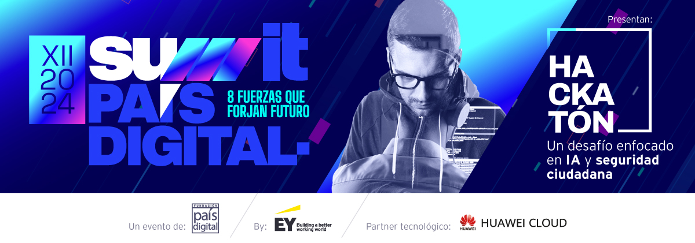

# Hackatón Summit País Digital 2024
Repositorio oficial de la Hackatón Summit País Digital by EY colabora Huawei Cloud 2024

# Recursos útiles
Este repositorio está organizado por cada una de las sesiones que se llevarán a cabo, en este ciclo de capacitación. En cada una de las sesiones, se dejará el material que se haya revisado por parte del expositor

# Sesiones de YouTube

En el siguiente listado, se puede tener acceso a la grabación de la sesión respectiva:

* Sesión 1 **Obligatoria**: martes 06 de agosto de 19:00 a 20:30 horas de Chile - _Creatividad y resolución de problemas_ [Link de acceso](https://www.youtube.com/watch?v=z8t_yIM1J6c)
* Sesión 2: Jueves 08 de agosto de 19:00 a 20:30 horas de Chile - _Tecnología al servicio de la seguridad pública: los desafíos de Las Condes_ [Link de acceso](https://www.youtube.com/watch?v=HteXojsr4FE)
* Sesión 3: Martes 13 de agosto de 19:00 a 20:30 horas de Chile - _Técnicas aplicadas en Computer Vision_ [Link de acceso](https://www.youtube.com/watch?v=E4LZZcpkcHc)
* Sesión 4: Martes 20 de agosto de 19:00 a 20:30 horas de Chile - _Plataforma Huawei de Computer Vision_ [Disponible próximamente]()
* Sesión 5: Miércoles 21 de agosto de 19:00 a 20:30 horas de Chile - _Assembly de Herramientas para CV_ [Disponible próximamente]()
* Sesión 6 **Obligatoria**: Martes 27 de agosto de 19:00 a 20:30 horas de Chile – _Herramientas avanzadas de Computer Vision y Hands-on_ [Disponible próximamente]()
* Sesión 7 **Obligatoria**: Jueves 29 de agosto de 19:00 a 20:30 horas de Chile – _Pitch Class y Aclaratorias Generales_